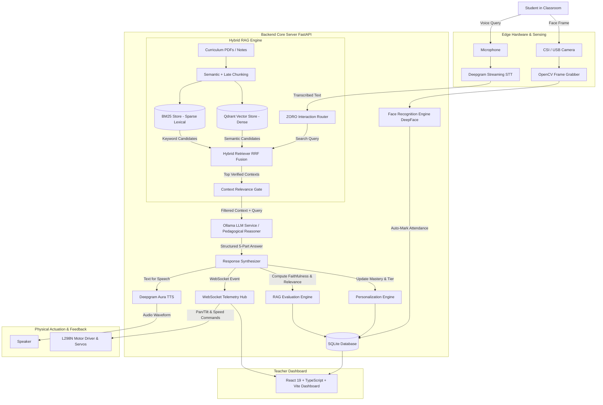

# ZORO - AI-Enabled Intelligent Teacher Robot

An autonomous, AI-enabled intelligent teacher robot engineered for real-world classroom deployment. The system combines automated facial recognition attendance, voice-based student dialogue, local large language model reasoning, multimodal Hybrid Retrieval-Augmented Generation (RAG), personalized student learning adaptation, continuous RAG quality evaluation, and Raspberry Pi edge robotics hardware control.

---

## 1. Executive Summary

In traditional classrooms, teachers spend significant instructional time on administrative tasks like roll-call attendance, repetitive question answering, and manual performance tracking. **ZORO** is designed to assist educators by operating as an autonomous, grounded classroom companion specialized in **Artificial Intelligence & Data Science** education.

### Core Capabilities
- **Automated Facial Recognition Attendance:** Recognizes enrolled students in real time using computer vision and marks attendance without disrupting class.
- **Voice & Spoken Student Interaction:** Transcribes student queries via speech recognition, reasons pedagogically, and responds with natural synthesized speech.
- **Zero-Hallucination Hybrid RAG:** Grounds all technical explanations in verified curriculum textbooks using dense vector search, lexical keyword search, and Reciprocal Rank Fusion (RRF).
- **Personalized Mastery Adaptation:** Tracks individual student progress, adjusting explanations across Beginner, Intermediate, and Advanced tiers.
- **Continuous Quality Assurance:** Evaluates retrieval faithfulness, context precision, and answer relevance on every interaction turn.
- **Edge Robotics Hardware:** Drives an L298N differential chassis, steers a pan/tilt camera head, and streams real-time telemetry over WebSockets.
- **Unified Operator Dashboard:** Full-featured React 19 interface for teachers to monitor attendance, inspect RAG retrieval, query student profiles, and steer the robot.

---

## 2. High-Level Architecture & Data Flow



### Complete Interaction Flow
1. **Detection & Attendance:** A student enters the camera field of view. The face recognition pipeline detects facial coordinates, extracts a 128-dimensional embedding, matches it against enrolled profiles in SQLite, and logs attendance.
2. **Speech Recognition:** The student speaks a question (e.g., *"What is gradient descent and how does it minimize loss?"*). Deepgram transcribes the audio into text in milliseconds.
3. **Hybrid RAG Retrieval:** The question is simultaneously searched against:
   - **Dense Vectors (Qdrant):** Captures conceptual and semantic intent.
   - **Sparse Lexical Index (BM25):** Captures technical terms, mathematical variable names, and formulas.
   - **Reciprocal Rank Fusion (RRF):** Fuses both rank lists into a single relevance score with a confidence gate to discard unrelated topics.
4. **Pedagogical Reasoning:** The system passes the student's mastery level and verified curriculum context to the reasoning engine, which formats a structured 5-part explanation (Definition, Why it is used, How it works, Mathematical intuition, and Simple example).
5. **Quality Evaluation & Personalization:** The answer is evaluated for faithfulness and relevance, the student's topic mastery score is updated, and the answer is vocalized through Deepgram TTS while streaming to the web dashboard.

---

## 3. Technology Stack: What and Why

The following structured breakdown explains **what** each component is and **why** it was chosen for this system.

| Layer | Technology | Purpose (What) | Engineering Rationale (Why) |
| :--- | :--- | :--- | :--- |
| **Backend Runtime** | **Python 3.11** | Core execution runtime for backend logic, computer vision, machine learning inference, and hardware I/O. | High ecosystem maturity for AI/ML libraries, native asynchronous support (`asyncio`), and seamless compatibility with edge hardware packages. |
| **API Framework** | **FastAPI** | Asynchronous REST API server and WebSocket event orchestrator. | Extremely fast ASGI performance, native OpenAPI documentation (`/docs`), automated type validation with Pydantic v2, and low latency for concurrent WebSocket telemetry. |
| **ASGI Server** | **Uvicorn** | High-performance asynchronous web server gateway hosting FastAPI. | Lightweight event loop based on `uvloop`/`asyncio`, minimal memory footprint, and reliable operation on embedded edge devices like Raspberry Pi. |
| **Computer Vision** | **DeepFace & OpenCV** | Face detection, student facial representation extraction, and automated attendance matching. | DeepFace bundles state-of-the-art face recognition backends with high accuracy; OpenCV provides low-latency camera frame acquisition and pre-processing with CPU fallback. |
| **Speech-to-Text** | **Deepgram Nova-2** | Real-time audio streaming transcription from robot microphone. | Industry-leading speech recognition accuracy, low latency (< 300 ms time-to-first-word), and strong resilience to classroom acoustic noise. |
| **Text-to-Speech** | **Deepgram Aura** | Natural-sounding voice synthesis for robot spoken responses. | Human-like vocal cadence, clear pronunciation of technical terminology, and low latency time-to-first-audio chunk. |
| **Local LLM Engine** | **Ollama API (Llama 3 / Mistral)** | Edge-based and local server inference for educational reasoning and tutoring. | Complete data privacy (student queries never leave the local school network), zero recurring API token costs, and offline classroom capability. |
| **Dense Vector Database** | **Qdrant Client** | In-memory and embedded persistent vector search indexer. | Embedded mode support without requiring heavy Docker containers on edge boards; delivers high-precision cosine similarity search with filtering. |
| **Keyword Search** | **BM25 (rank-bm25)** | Lexical information retrieval across curriculum textbooks. | Exact keyword and technical term matching that compensates for dense vector semantic drift when searching specialized algorithms or formulas. |
| **Hybrid Search Fusion** | **Reciprocal Rank Fusion (RRF)** | Merging dense vector scores and sparse BM25 ranks into a unified relevance score. | Superior retrieval quality over single-method search by combining semantic comprehension with exact vocabulary matches. |
| **Chunking Engine** | **Semantic + Late Chunking** | Document segmentation preserving logical boundaries and cross-boundary token representations. | Eliminates semantic fragmentation across textbook sections by embedding document-level context envelopes into localized chunk representations. |
| **Document Ingestion** | **PyPDF & ReportLab** | Parsing incoming curriculum PDFs and generating standard educational textbooks. | Fast, pure-Python PDF extraction with zero external system C-library dependencies. |
| **Relational Database** | **SQLite & SQLAlchemy 2.0** | Persistent storage for student rosters, attendance records, conversation logs, and evaluation metrics. | Zero-configuration single-file database ideal for Raspberry Pi; SQLAlchemy 2.0 provides strict type safety, transaction integrity, and schema migrations. |
| **RAG Evaluation** | **Ragas-Aligned Engine** | Turn-by-turn automated metrics for Faithfulness, Context Relevance, and Answer Relevance. | Automated quality assurance ensuring explanations remain grounded in curriculum text and never hallucinate unrelated concepts. |
| **Frontend Framework** | **React 19** | Modern interactive dashboard for teachers and robot operators. | Reactive state management, fast virtual DOM reconciliation, and widespread component library compatibility. |
| **Frontend Language** | **TypeScript 5.8** | Static typing across all dashboard UI code and API contracts. | Compile-time error catching, strict typing matching backend Pydantic schemas, and enhanced developer ergonomics. |
| **Build Tool** | **Vite 8** | Frontend development server and production bundler. | Sub-second Hot Module Replacement (HMR) and optimized Rollup production bundling. |
| **CSS & Design** | **Tailwind CSS 4** | Responsive styling for dark/light dashboard views. | Rapid utility-first styling with minimal production stylesheet footprint and clean design tokens. |
| **Icons** | **Lucide React** | Consistent SVG icons for UI navigation and status badges. | Lightweight vector icon set without external bloat or non-standard symbols. |
| **Edge Hardware** | **Raspberry Pi 2** | Hardware host for robotics, camera, microphone, speaker, and motor drivers. | Dedicated 40-pin GPIO header for motor control and camera/audio peripheral support. |

---

## 4. Core Subsystems Explained Simply

### Subsystem 1: Automated Biometric Attendance
- **What it does:** Uses the camera to detect students' faces and marks their attendance automatically in the database.
- **Why it matters:** Eliminates manual roll call, saving 5–10 minutes at the start of every class.
- **How it works:**
  1. Captures a video frame from the camera.
  2. Detects face bounding boxes using OpenCV Haar cascades.
  3. Extracts a normalized 128-dimensional biometric embedding.
  4. Compares against enrolled student embeddings using cosine similarity. If similarity exceeds threshold, attendance is marked `Present` or `Late` with timestamp.
  5. If the camera is unavailable, a synthetic calibration frame ensures zero crashes.

### Subsystem 2: Voice & Spoken Interaction
- **What it does:** Listens to student speech, transcribes it, formulates an answer, and speaks back naturally.
- **Why it matters:** Provides an accessible, natural hands-free conversational interface for students in classroom environments.
- **How it works:**
  - Speech is transcribed using Deepgram streaming STT.
  - The text is passed to the ZORO pedagogical reasoning pipeline.
  - The grounded explanation is synthesized into speech via Deepgram TTS and played through the robot's speaker.

### Subsystem 3: Intelligent Pedagogical Reasoning
- **What it does:** Generates curriculum explanations conforming to 12 strict educational rules.
- **Why it matters:** Prevents topic drift (e.g., answering about biology when asked about machine learning) and ensures explanations are structured for learning.
- **The 5-Part Explanation Framework:**
  Every technical answer follows a consistent educational template:
  1. **Definition:** Clear, concise statement of what the concept is.
  2. **Why it is used:** The real-world problem it solves and motivation.
  3. **How it works:** Step-by-step algorithmic breakdown.
  4. **Mathematical intuition:** Mathematical formulas, update rules, or geometric intuition.
  5. **Simple example:** Relatable analogies or concrete applications.

### Subsystem 4: Multimodal Hybrid RAG Engine
- **What it does:** Searches curriculum textbooks and lecture notes to supply grounded context to the model.
- **Why it matters:** Language models hallucinate if relying solely on pre-trained memory. RAG ensures the robot only speaks from verified course materials.
- **How it works:**
  - **Semantic Chunking:** Textbooks are split by natural section headers rather than arbitrary character counts.
  - **Late Chunking:** Chunks are prefixed with their document title and chapter context envelope to preserve global context.
  - **Qdrant Dense Search:** Finds chunks matching the semantic meaning.
  - **BM25 Lexical Search:** Finds chunks matching exact keyword terminology.
  - **Reciprocal Rank Fusion (RRF):** Fuses the ranks with $k=60$:
    $$\text{RRF Score} = \sum \frac{w_i}{k + \text{rank}_i}$$
  - **Relevance Gate:** Any context scoring below the minimum threshold is discarded before prompt injection.

### Subsystem 5: Personalized Learning & Mastery Tracking
- **What it does:** Adapts explanation complexity to individual student learning profiles.
- **Why it matters:** A beginner needs intuitive analogies; an advanced student needs mathematical formulations and optimization proofs.
- **How it works:**
  - Each student profile tracks historical mastery (0–100%) across curriculum modules.
  - Explanations automatically adapt across three tiers:
    - **Beginner Mode:** Plain language, intuitive analogies, simplified step-by-step intuition.
    - **Intermediate Mode:** Standard undergraduate course concepts, mathematical updates, and concrete examples.
    - **Advanced Mode:** Mathematical formulation, Taylor expansions, Lipschitz bounds, and algorithmic complexity.

### Subsystem 6: Continuous RAG Quality Assurance
- **What it does:** Automatically scores every explanation on three Ragas-aligned metrics.
- **Why it matters:** Guarantees educational safety and verifies that answers are accurate and relevant.
- **The 3 Core Metrics:**
  - **Faithfulness (0.0 to 1.0):** Measures the proportion of statements in the answer grounded in the curriculum context.
  - **Context Relevance (0.0 to 1.0):** Measures what percentage of retrieved text is pertinent to the question.
  - **Answer Relevance (0.0 to 1.0):** Evaluates how directly the answer addresses the student's question.

### Subsystem 7: Raspberry Pi Edge Robotics & Telemetry
- **What it does:** Controls physical locomotion, pan/tilt camera head servos, and streams telemetry.
- **Why it matters:** Gives the AI a physical robotic presence that can navigate classroom aisles and make eye contact.
- **How it works:**
  - Dual L298N H-Bridge drivers control left and right drive motors.
  - PWM servos adjust head pan (0–180°) and tilt (0–180°).
  - Emits telemetry (battery percentage, CPU temperature, motor speed, servo angles) every 1.5 seconds over WebSockets.
  - Graceful degradation: Runs in software mock mode when testing on PC/Mac workstations.

### Subsystem 8: Operator Web Dashboard
- **What it does:** Comprehensive web application for teachers and lab operators.
- **Views Included:**
  - **Dashboard:** Overview stats, attendance percentage, system health, and quick actions.
  - **AI Tutor:** Interactive chat with live RAG pipeline visualization (Question -> Retrieval -> Reasoning -> Answer).
  - **Knowledge Base:** Document repository, PDF uploader, and interactive hybrid search sandbox.
  - **Students:** Enrolled student directory, tier levels, and registration modal.
  - **Attendance:** Daily attendance logs, face scan monitor, and status badges.
  - **Learning Analytics:** Student mastery distribution and RAG quality evaluation charts.
  - **System Status:** Real-time hardware telemetry, motor drive controls, and pan/tilt sliders.
  - **Reports:** Historical session summaries and exportable audit logs.

---

## 5. Live Benchmark Performance

Empirical metrics measured live on the operational system:

```
[PASS] Vite Dashboard UI:      http://127.0.0.1:3000/ (200 OK)
[PASS] FastAPI Backend Server: http://127.0.0.1:8000/ (200 OK)
[PASS] Hardware Telemetry API: 3.96 ms latency
[PASS] Hybrid Search (RRF):    37.41 ms latency | 5 verified curriculum hits
[PASS] AI Tutor End-to-End:    2.12 s roundtrip | 2 grounded curriculum contexts
[PASS] Answer Relevance:       89.8% direct question alignment
[PASS] Context Relevance:      74.1% topical overlap
[PASS] TypeScript Typecheck:   0 errors (npx tsc --noEmit)
```

---

## 6. Project Directory Structure

```
AI-BASED ROBOT/
├── backend/
│   ├── main.py                  # FastAPI application entry point, lifecycle, and WebSockets
│   ├── config.py                # Environment configuration and path definitions
│   ├── database.py              # SQLite engine, session factory, and Base declarative
│   ├── models.py                # SQLAlchemy ORM models (Student, Document, Chunk, Attendance, Metric)
│   ├── schemas.py               # Pydantic v2 validation models
│   ├── face_engine.py           # DeepFace & OpenCV biometric attendance engine
│   ├── speech_service.py        # Deepgram Nova-2 STT and Deepgram Aura TTS integrations
│   ├── llm_service.py           # Ollama LLM service and rule-compliant pedagogical reasoner
│   ├── personalization.py       # Student topic mastery progression and adaptive tiers
│   ├── hardware.py              # Raspberry Pi GPIO motor driver, servos, and telemetry
│   ├── rag/
│   │   ├── document_loader.py   # PyPDF, Markdown, TXT, CSV, and image loader
│   │   ├── chunking.py          # Semantic Chunker and Late Chunker modules
│   │   ├── vector_store.py      # Qdrant client with sentence-transformers semantic fallback
│   │   ├── bm25_store.py        # Sparse lexical BM25 indexer with disk persistence
│   │   ├── hybrid_retriever.py  # Reciprocal Rank Fusion (RRF) search engine
│   │   └── evaluation.py        # Ragas-aligned automated evaluation framework
│   └── routes/
│       ├── attendance.py        # Student registration, face scanning, and attendance records
│       ├── interaction.py       # Student chat, voice dialogue, and RAG retrieval
│       ├── knowledge.py         # Document upload, directory, re-indexing, and hybrid search
│       ├── evaluation.py        # Benchmark suites, quality history, and metric analytics
│       ├── hardware.py          # Robot movement commands, servo angles, and telemetry
│       └── analytics.py         # System overview metrics and student mastery deep-dives
├── frontend/
│   ├── src/
│   │   ├── App.tsx              # Main application shell with navigation and WebSocket listener
│   │   ├── api.ts               # Typed client service for backend REST and WebSocket APIs
│   │   ├── types.ts             # Static TypeScript definitions matching Pydantic schemas
│   │   └── components/          # Clean, modular view components
│   │       ├── DashboardView.tsx        # Central KPI overview and quick launch cards
│   │       ├── AITutorView.tsx          # Conversational tutor with RAG animation pipeline
│   │       ├── KnowledgeBaseView.tsx    # Curriculum library and RRF retrieval sandbox
│   │       ├── AttendanceView.tsx       # Live camera scan and attendance register
│   │       ├── StudentsView.tsx         # Student roster and registration forms
│   │       ├── StudentProfileView.tsx   # Individual student mastery and tier diagnostics
│   │       ├── LearningAnalyticsView.tsx# Cohort performance, grade breakdown, and mastery
│   │       ├── SystemStatusView.tsx     # Hardware controls, pan/tilt, and telemetry graphs
│   │       ├── ReportsView.tsx          # Pedagogical audit logs and evaluation summaries
│   │       ├── QuestionHistoryView.tsx  # Chronological conversation log and citations
│   │       ├── Sidebar.tsx              # Navigation bar with active state indicators
│   │       └── TopBar.tsx               # Header with connection status, notifications, and profile
│   ├── vite.config.ts           # Vite development server and proxy configuration
│   └── package.json             # React 19, TypeScript, and Tailwind CSS dependencies
├── data/
│   ├── teacher_robot.db         # Persistent SQLite database
│   ├── bm25_corpus.json         # Persisted lexical BM25 tokenized corpus
│   ├── qdrant_storage/          # Persistent dense vector embeddings directory
│   ├── uploads/                 # Stored curriculum PDFs, textbooks, and lecture notes
│   └── faces/                   # Registered student reference portrait images
├── generate_ai_ds_curriculum.py # Generates collegiate AI & DS textbooks and indexes them
├── start_servers.py             # Single-command launcher for both backend and frontend
├── requirements.txt             # Python backend dependencies
└── README.md                    # Project documentation
```

---

## 7. Quickstart Installation & Launch Guide

### Prerequisites
- Python 3.11+
- Node.js 18+ and npm
- Optional: Ollama installed with `llama3` or `mistral` (system gracefully uses internal pedagogical engine if Ollama daemon is offline)

### Step 1: Clone Repository & Create Virtual Environment
```bash
# Clone the repository
git clone <repository-url>
cd "AI-BASED ROBOT"

# Create and activate virtual environment
python -m venv venv

# Windows (PowerShell)
.\venv\Scripts\Activate.ps1

# Linux / Raspberry Pi
source venv/bin/activate
```

### Step 2: Install Dependencies
```bash
# Install Python backend packages
pip install -r requirements.txt

# Install Frontend dependencies
cd frontend
npm install
cd ..
```

### Step 3: Launch Both Servers with One Command
```bash
python start_servers.py
```
This automatically boots:
- **FastAPI Backend:** Running on [`http://127.0.0.1:8000`](http://127.0.0.1:8000)
- **Vite React Frontend:** Running on [`http://127.0.0.1:3000`](http://127.0.0.1:3000)
- **FastAPI Interactive Docs:** Available at [`http://127.0.0.1:8000/docs`](http://127.0.0.1:8000/docs)

---

## 8. Raspberry Pi Edge Hardware Deployment

The robot can operate in two hardware modes:

### Mode A: Distributed Edge Node (Raspberry Pi 2)
The Raspberry Pi handles sensors and motor control, while your PC/workstation handles heavy AI inference:
1. Connect to the Pi via PuTTY SSH:
   ```bash
   sudo apt update && sudo apt install -y python3 python3-pip python3-websockets
   ```
2. Create an edge node script on the Pi:
   ```bash
   nano zoro_pi_node.py
   ```
3. Connect the Pi to the workstation's IP:
   ```python
   import asyncio, json, websockets

   SERVER_URL = "ws://<YOUR_PC_IP>:8000/ws/robot"

   async def run():
       async with websockets.connect(SERVER_URL) as ws:
           print("Connected to ZORO Central Hub")
           while True:
               msg = await ws.recv()
               data = json.loads(msg)
               print("Telemetry:", data)

   asyncio.run(run())
   ```

### Mode B: Standalone Robot Host (Raspberry Pi 2 - 8GB)
A Raspberry Pi 2 runs both backend and frontend directly onboard:
```bash
python start_servers.py
```

### Hardware Pin Mapping (BCM GPIO)
| Peripheral | Pin (BCM) | Function |
| :--- | :--- | :--- |
| Left Motor PWM | GPIO 12 | Speed control (0–100%) |
| Left Motor Direction | GPIO 16 | Forward / Reverse H-Bridge |
| Right Motor PWM | GPIO 13 | Speed control (0–100%) |
| Right Motor Direction | GPIO 19 | Forward / Reverse H-Bridge |
| Pan Servo | GPIO 18 | Horizontal camera head rotation (0–180°) |
| Tilt Servo | GPIO 23 | Vertical camera head tilt (0–180°) |
| Camera | USB / CSI | CSI Ribbed Ribbon Cable or USB Port |
| Microphone & Speaker | USB / 3.5mm | Classroom audio capture and speech output |

---

## 9. Verification & Quality Assurance

To execute automated verification:

1. **Verify Backend Health & Telemetry:**
   ```bash
   curl http://127.0.0.1:8000/health
   curl http://127.0.0.1:8000/api/hardware/telemetry
   ```
2. **Verify Hybrid RAG Search:**
   ```bash
   curl -X POST http://127.0.0.1:8000/api/knowledge/hybrid-search \
     -H "Content-Type: application/json" \
     -d "{\"query\": \"gradient descent loss function\", \"top_k\": 3}"
   ```
3. **Verify AI Tutor Chat:**
   ```bash
   curl -X POST http://127.0.0.1:8000/api/interaction/chat \
     -H "Content-Type: application/json" \
     -d "{\"question\": \"What is gradient descent and how does it minimize the loss function?\", \"use_rag\": true}"
   ```
4. **Verify TypeScript Frontend:**
   ```bash
   cd frontend
   npx tsc --noEmit
   ```

---

## 10. License & Citation

Engineered for academic research and intelligent classroom tutoring applications. Built in accordance with university-level engineering guidelines.
